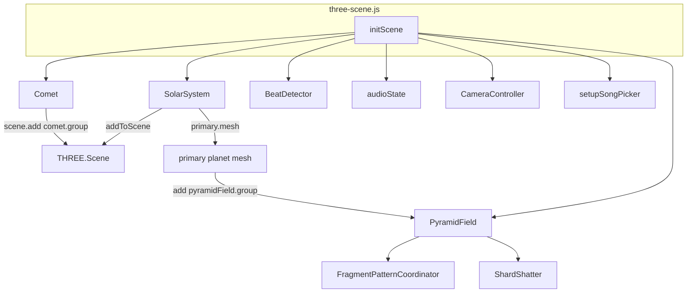
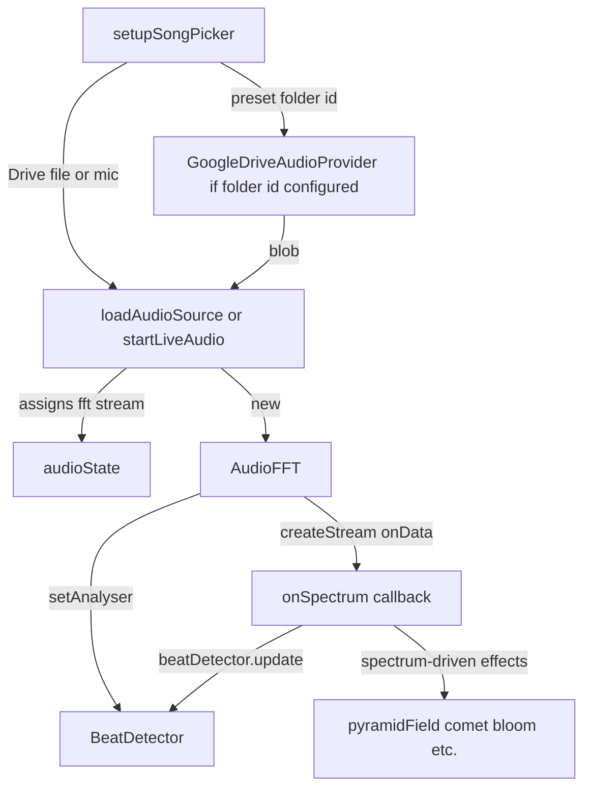
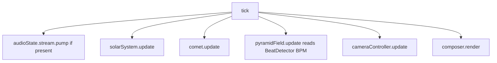

# NoGravityWebsite — project map (classes & structure)

**Entry:** [`index.html`](../index.html) loads [`src/scene/three-scene.js`](../src/scene/three-scene.js) as the sole application module (ES modules + import maps for Three.js, lil-gui, realtime-bpm-analyzer).

**Design note:** This repo favors **plain functions and state objects** for orchestration (especially in `three-scene.js`). **Subclassing is minimal:** only **`FFTStream`** uses `extends` (to **`EventTarget`**). Most “hierarchy” is **composition** (who constructs whom) and **Three.js scene graph** (`THREE.Object3D` descendants), not ES6 `extends` chains.

---

## 1. ES6 class inheritance (`extends`)

**Only one `extends`** exists in application modules under `src/` (this section counts shipped code, not `*.test.js` helpers):

```
EventTarget (Web API)
    └── FFTStream   [src/audio/audio-fft.js]
```

- **`FFTStream`** — private to `audio-fft.js`; extends **`EventTarget`** so spectrum frames dispatch as `data` events.
- **`AudioFFT`** — exported class; does **not** extend anything. It **constructs** `FFTStream` instances via `createStream()`.

All other application classes listed below are **standalone** (no `extends`).

---

## 2. Inventory — application classes (production `src/`)

| Class | Module | Export | Role |
|--------|--------|--------|------|
| `FFTStream` | [`src/audio/audio-fft.js`](../src/audio/audio-fft.js) | internal | FFT pump + `EventTarget` events |
| `AudioFFT` | [`src/audio/audio-fft.js`](../src/audio/audio-fft.js) | named `export class` | Loads audio / MediaStream, exposes analyser + streams |
| `BeatDetector` | [`src/audio/beat-detector.js`](../src/audio/beat-detector.js) | `default` | BPM / bar / onset logic (uses realtime-bpm-analyzer) |
| `GoogleDriveAudioProvider` | [`src/google/google-drive-audio.js`](../src/google/google-drive-audio.js) | `export class` + `default` | Lists / fetches audio from Google Drive |
| `FragmentPatternCoordinator` | [`src/pyramid/fragment-pattern-coordinator.js`](../src/pyramid/fragment-pattern-coordinator.js) | `default` | Wave-level slotting for shard field patterns |
| `ShardShatter` | [`src/pyramid/shard-shatter.js`](../src/pyramid/shard-shatter.js) | `default` | Pyramid → triangle fragments, shatter simulation |
| `PyramidField` | [`src/pyramid/pyramid-field.js`](../src/pyramid/pyramid-field.js) | `default` | Orbiting pyramids + pattern/shatter orchestration |
| `SolarSystem` | [`src/scene/solar-system.js`](../src/scene/solar-system.js) | `default` | Sun, planets, stars, goop hooks |
| `CameraController` | [`src/scene/camera-controller.js`](../src/scene/camera-controller.js) | `default` | Input, orbit / follow / free camera |
| `Comet` | [`src/scene/comet.js`](../src/scene/comet.js) | `default` | Comet trail visual following an anchor |
| `AudioManager` | [`src/scene/audio-manager.js`](../src/scene/audio-manager.js) | `default` | Encapsulates FFT stream + file/live toggle (mirrors logic also inlined in `three-scene`) |

**Not classes:** [`src/google/google-auth.js`](../src/google/google-auth.js) exports **functions** (GIS, Picker, token). UI modules ([`src/ui/`](../src/ui/)) use **factory functions** and DOM (e.g. [`screen-dials.js`](../src/ui/screen-dials.js), [`gui-knob.js`](../src/ui/gui-knob.js), [`canvas-cockpit-knob.js`](../src/ui/canvas-cockpit-knob.js)). [`src/scene/planet-goop-material.js`](../src/scene/planet-goop-material.js), [`planet-pulse.js`](../src/scene/planet-pulse.js), [`fragment-pattern-math.js`](../src/pyramid/fragment-pattern-math.js), [`exponential-drag.js`](../src/math/exponential-drag.js) are **functions / constants**, not classes.

---

## 3. Composition & runtime wiring (main scene)

These charts are **not** ES6 inheritance (see §1) and **not** the full Three.js scene graph (see §4). They summarize [`three-scene.js`](../src/scene/three-scene.js): **A** = what **`initScene`** constructs and attaches; **B** = **deferred** audio loading after boot; **C** = the **`tick`** / `requestAnimationFrame` loop (separate from construction).

**Legend:** solid arrows = creates, registers, or attaches in code; **B** adds paths that run when the user picks audio or when Drive is configured.

### A — `initScene` bootstrap (construction)



### B — Audio after boot (deferred; not synchronous with A)

`BeatDetector` and `audioState` already exist; **`AudioFFT`** is created when the user picks a **Google Drive** file (blob → `loadAudioSource`) or enables the **mic** (`startLiveAudio`).



### C — Frame loop (`tick`; each animation frame)



- **`AudioFFT`** is created only inside **`loadAudioSource`** (Drive blob) or **`startLiveAudio`** (mic), not in the synchronous **`initScene`** block; it is **not** wired through **`AudioManager`** in the main bundle (that class is for tests/consumers).
- **`AudioManager`** is re-exported from `three-scene.js` for tests/consumers; **unit tests** construct it directly ([`audio-manager.test.js`](../src/scene/audio-manager.test.js)).
- **`PyramidField`** constructs **`FragmentPatternCoordinator`** and **`ShardShatter`** internally.
- **`GoogleDriveAudioProvider`** is created inside **`setupSongPicker`** only when a **preset Drive folder id** (or equivalent config) is present; otherwise there is no Drive provider.
- **`BeatDetector`**: created in **`initScene`**; **`setAnalyser`** runs when **`AudioFFT`** is ready; **`pyramidField.update`** in **`tick`** reads BPM / bar data from **`BeatDetector`**.

---

## 4. Three.js “hierarchy” (scene graph, not ES6)

These are **not** project subclasses; they are **three.js** types built inside modules:

- **`SolarSystem`** builds `THREE.Mesh`, `THREE.Group`, `THREE.Points`, lights.
- **`Comet`**, **`PyramidField`** attach meshes/groups to the scene or to a planet.
- Shards/fragments use `THREE.BufferGeometry`, `THREE.Mesh`, etc., inside **`ShardShatter`**.

The **logical** parent of the pyramid field is the **primary planet** from `SolarSystem` (see comments and attachment in `three-scene.js`).

---

## 5. Test-only classes

Vitest files sometimes define **local fakes** (e.g. `FakeRenderer`, `FakeFFT`) — they are **not** part of the shipped hierarchy.

---

## 6. Summary

| Kind | Count / note |
|------|----------------|
| `extends` in app code | **1** (`FFTStream` → `EventTarget`) |
| Application classes | **11** named types in the table above (including internal `FFTStream`) |
| Primary architectural shape | **Module graph + composition** in `three-scene.js`, **scene graph** in Three.js |

---

*Generated for repo snapshot; re-run `rg "class "` under `src/` if you add new types.*
